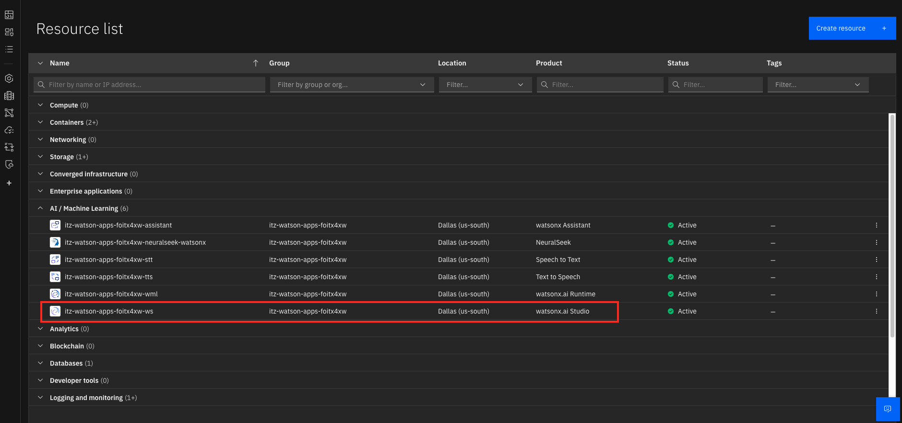

## Generic Property Demo
An AI pipeline using synthetic data to demonstrate different use cases. The purpose of this is for us to be able showcase the demo to potential clients without breaking NDA.

This demo is aimed to be as low code as possible, the original documentation is [here](https://github.com/watson-developer-cloud/assistant-toolkit/tree/41f6d6d519384e2f97aa5e8ddc7cfb589a8e9b4d/integrations/extensions/starter-kits/language-model-conversational-search#example-1-connect-your-assistant-to-elasticsearch-and-watsonx-via-custom-extensions). The steps below is the updated version.

The use cases included as part of this demo:
- RAG pattern
- Text2SQL

# How-to-run-this-demo
The following are the steps for you to get this demo up and running. We assume you already have an environment reserved. If not you can proceed to reserving an env in [TechZone](https://techzone.ibm.com/collection/technology-patterns/journey-ai-assistants) with ES, Wx.Ai and Wx Assistant as part of the component

# Project IBM Cloud Configuration

## Step 1 - Generate IBM API KEY
Follow the image below to get your IBM cloud api key. Make sure to save it in your ```.env```. We will access it through python later on.


## Step 2 - Get Elastic Search (ES) Service Credentials & SSL Cert
Get to ES from the resource list. From the overview page scroll down and click on 'Download Certificate'. Store it in ```kibana/config```.

  
Similar to previous step, you can save your service creds in ```.service_credentials```, we won't be accessing programmatically but you will need to refer to it a few time.

Similar to previous step, you can save your service creds in ```.service_credentials```, we won't be accessing programmatically but you will need to refer to it a few time.

Next, complete follow this [tutorial](https://github.com/watson-developer-cloud/assistant-toolkit/blob/41f6d6d519384e2f97aa5e8ddc7cfb589a8e9b4d/integrations/extensions/docs/elasticsearch-install-and-setup/ICD_Elasticsearch_install_and_setup.md). You DO NOT need to create any index, you can create just to test the ES. It will be automatically created later in Watsonx Assistant.

## Step 3 - Test ES
You can test your ES with following command.
```
curl -k "${ES_URL}/property" \
--cacert <path-to-your-cert-file>\
  -H "Authorization: ApiKey "${ES_API_KEY}"" \
  -H "Content-Type: application/json"
  ```
if there's no error that means your ES good to go.

## Step 4 - Setup Wx project
Get to Wx console from the resource list. 

Choose IBM Cloud Pak for Data and you will landed on Wx Studio console. Next, create a new project and associate it with *Watson Machine Learning* and *Watsonx Assistant*.


From the same tab, you can naviate to *General* and get the ```project ID```. Remember to store this in ``.env`` as well.


## Step 5 - Create Watsonx Assistant Project
Again, you can navigate to Wx Assistant from the resource list and launch it. 


Follow through all the steps to create new assistant.

## Step 6 - Setup ES Watsonx Assistant integration

Follow this [tutorial](https://github.com/watson-developer-cloud/assistant-toolkit/blob/41f6d6d519384e2f97aa5e8ddc7cfb589a8e9b4d/integrations/extensions/starter-kits/elasticsearch/README.md) to setup ES integration. You DO NOT need to setup ML instance or Elser V2 model. By default it will automatically setup. You just need to change the action variable to your ES value.

## Step 7 - Upload your data
Upload your documents/pdf to ES through Wx Assistant by clicking *Integration* from the left side panel and click ES API.


## Step 8 - Upload watsonx actions.
Follow this [tutorial](https://github.com/watson-developer-cloud/assistant-toolkit/tree/41f6d6d519384e2f97aa5e8ddc7cfb589a8e9b4d/integrations/extensions/starter-kits/language-model-conversational-search#example-1-connect-your-assistant-to-elasticsearch-and-watsonx-via-custom-extensions). If you have configure everything correctly, when you upload the given action from the tutorial, you should get all action without error (all gree right-mark). Make sure to update your action variable. You can navigate there from the left panel and click *Actions* then *Created by you* there will be variable with description requesting your updates.

## Step 9 - Test Demo!
Click on preview and test whether your assistant able to answer based on provided documents.

# Deployment to Code Engine

## Step 1 - Build your image
Run the following command to build and test your image locally.

```
podman build -t gen-prop . --no-cache && \ 
podman run --rm -p 8080:8080 -p 3000:3000 \
-e IBM_API_KEY=<your-api-key> -e PROJECT_ID=<your-project-id> \
gen-prop
```

## Step 2 - Configure Code Engine (CE)
From the resource list select Code Engine. 

  
There should be a project already created for you, from there you can proceed to create app.


## Step 2 - Deploy your image to CE

## Step 2 - Test your demo
